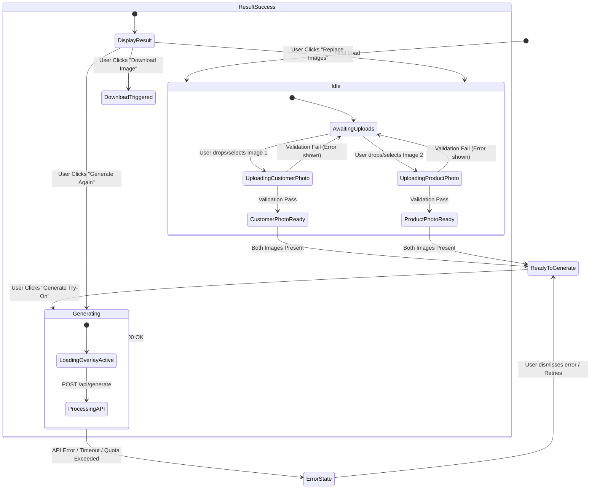

# HairOriginals AI Virtual Try-On — Comprehensive Project Audit

This document provides a complete audit of the **HairOriginals AI Virtual Try-On** application (`hair-tryon`). It covers the current state of the project, architecture, state management, API endpoints, key dependencies, component structure, and complete user workflows.

---

## 1. Project Overview & Technology Stack

**HairOriginals AI Virtual Try-On** is a modern web application designed to let users visually test hair extensions, wigs, and toppers on their own photos using generative AI. It leverages Google Gemini's multimodal capabilities to perform photorealistic hair transfer while preserving facial identity, clothing, pose, and lighting.

### Core Tech Stack
- **Framework**: [Next.js 16.2.9](file:///Users/anikket.singh/Desktop/AI%20try%20on%20/package.json#L14) (App Router architecture with TypeScript)
- **UI Library**: [React 19.2.4](file:///Users/anikket.singh/Desktop/AI%20try%20on%20/package.json#L15) & [React DOM 19.2.4](file:///Users/anikket.singh/Desktop/AI%20try%20on%20/package.json#L16)
- **Styling**: [Tailwind CSS v4](file:///Users/anikket.singh/Desktop/AI%20try%20on%20/package.json#L25) (`@tailwindcss/postcss`) with custom dark aesthetic, HSL gradients, glassmorphism, and animations
- **Icons**: [Lucide React 1.21.0](file:///Users/anikket.singh/Desktop/AI%20try%20on%20/package.json#L13)
- **AI / Multimodal SDK**: [@google/genai 2.10.0](file:///Users/anikket.singh/Desktop/AI%20try%20on%20/package.json#L12) (utilizing model `gemini-3.1-flash-image`)
- **Language**: [TypeScript 5](file:///Users/anikket.singh/Desktop/AI%20try%20on%20/package.json#L26)

---

## 2. Codebase Structure & File Map

```
/
├── app/
│   ├── api/
│   │   └── generate/
│   │       └── route.ts         # Serverless API route handling image generation & Gemini SDK execution
│   ├── favicon.ico
│   ├── globals.css              # Tailwind CSS v4 setup, dark theme resets, focus rings, keyframes
│   ├── layout.tsx               # Global root layout containing Navbar and Footer wrappers
│   └── page.tsx                 # Core client page managing full application state & workflows
├── components/
│   ├── Footer.tsx               # Persistent bottom footer with branding & attribution
│   ├── GenerateButton.tsx       # Primary CTA button with gradient shimmer and loading states
│   ├── ImagePreview.tsx         # Component rendering aspect-ratio constrained image previews
│   ├── ImageUploader.tsx        # Drag-and-drop file uploader with validation & accessibility
│   ├── LoadingOverlay.tsx       # Fullscreen processing modal with dual-gradient spinner & status cycling
│   ├── Navbar.tsx               # Sticky header with branding logo and status badge
│   └── ResultViewer.tsx         # Display container for generated results with action buttons
├── lib/
│   ├── gemini.ts                # Server-side helper interacting with @google/genai SDK
│   ├── prompt.ts                # Optimized AI prompt engineering for hair try-on transformations
│   └── types.ts                 # TypeScript models, guard functions, and validation constants
├── .env.local                   # Environment variables (stores GEMINI_API_KEY)
├── next.config.ts               # Next.js configuration (25MB body limit for server actions/requests)
└── package.json                 # Project manifest and dependency declarations
```

---

## 3. Application State Architecture

Centralized client-side state management is implemented in [`app/page.tsx`](file:///Users/anikket.singh/Desktop/AI%20try%20on%20/app/page.tsx#L11-L16) using React standard hooks. Below is the full state state machine map.

### Core Application State (`app/page.tsx`)
| State Variable | Type | Default | Description |
| :--- | :--- | :--- | :--- |
| `personImage` | `UploadedImage \| undefined` | `undefined` | Customer's base photo object (contains File, dataUrl, base64, mimeType). |
| `productImage` | `UploadedImage \| undefined` | `undefined` | Selected HairOriginals hair product photo object. |
| `result` | `GenerateResponse \| null` | `null` | Holds the generated output image's base64 string and MIME type upon success. |
| `loading` | `boolean` | `false` | Indicates active API request execution; triggers overlay and disables inputs. |
| `error` | `string \| null` | `null` | Stores error strings to be displayed in top alert banner. |

### Derived State
- **`canGenerate`**: Boolean flag computed as `!!personImage && !!productImage`. Enforces that both images must be uploaded before triggering generation.

### Component-Local States
- **[`ImageUploader.tsx`](file:///Users/anikket.singh/Desktop/AI%20try%20on%20/components/ImageUploader.tsx#L42-L44)**:
  - `dragOver` (`boolean`): Active state for visual drag-over feedback.
  - `error` (`string | null`): Localized file validation error (e.g., file too large, invalid format).
- **[`LoadingOverlay.tsx`](file:///Users/anikket.singh/Desktop/AI%20try%20on%20/components/LoadingOverlay.tsx#L16-L17)**:
  - `messageIndex` (`number`): Rotates status strings every 3,000ms.
  - `fade` (`boolean`): Controls opacity transition timing between status message swaps.

---

## 4. Workflows & State Transitions



### Detailed Workflow Analysis

#### Workflow 1: Image Upload & Client-Side Validation
1. **User Action**: The user selects or drags & drops an image into either the "Customer Photo" or "Hair Product" uploader zone.
2. **Validation (`ImageUploader.tsx`)**:
   - Checks MIME type against `["image/png", "image/jpeg", "image/webp"]`.
   - Checks file size against maximum limit of `10MB` (`10,485,760` bytes).
   - If invalid, sets local `error` state and displays inline red warning box.
3. **Processing**: Converts valid files into base64 data URLs via `FileReader` and updates global `personImage` or `productImage` state.
4. **CTA Enablement**: When both `personImage` and `productImage` are populated, `canGenerate` becomes `true`, unlocking the primary "Generate Try-On" CTA button.

#### Workflow 2: Generation Request & Server Processing
1. **Trigger**: User clicks "Generate Try-On".
2. **State Transition**: `loading` is set to `true`, `error` is cleared, and `result` is reset to `null`.
3. **UI Feedback**: `LoadingOverlay` is rendered modally with backdrop blur, preventing interaction. The modal cycles through human-friendly progress messages every 3 seconds (*"Preparing images...", "Analysing hair product...", "Generating AI try-on...", etc.*).
4. **API Request**: A `FormData` payload containing `personImage` and `productImage` files is POSTed to [`/api/generate`](file:///Users/anikket.singh/Desktop/AI%20try%20on%20/app/api/generate/route.ts#L6).
5. **Route Execution**:
   - Re-validates payload presence, MIME types, and file sizes.
   - Converts files to base64 buffer strings.
   - Calls [`generateTryOn()`](file:///Users/anikket.singh/Desktop/AI%20try%20on%20/lib/gemini.ts#L4) in `lib/gemini.ts`.
   - Sends multimodal content array (`[personInlineData, productInlineData, HAIR_TRYON_PROMPT]`) to Gemini SDK (`gemini-3.1-flash-image`) with `responseModalities: ["IMAGE", "TEXT"]`.
6. **Completion**:
   - **On Success (200)**: Server returns `{ imageBase64, mimeType }`. `result` state updates in `app/page.tsx`, and `loading` is set to `false`.
   - **On Failure**: Errors (400 Bad Request, 401 Unauthorized/Invalid API Key, 429 Quota Exceeded, 500 Server Error) are caught, parsed, and set into the global `error` state.

#### Workflow 3: Result Viewing & Export
1. **Render**: When `result` is present and `loading` is `false`, [`ResultViewer.tsx`](file:///Users/anikket.singh/Desktop/AI%20try%20on%20/components/ResultViewer.tsx#L13) renders with a smooth `animate-fade-in` transition, displaying the generated composite photograph with a corner watermark badge (`HairOriginals AI`).
2. **Available Actions**:
   - **Download Image**: Programmatically creates an invisible `<a>` element with a `data:${mimeType};base64,...` source and triggers browser file download formatted as `hairoriginals-tryon-<timestamp>.<ext>`.
   - **Generate Again**: Re-executes `handleGenerate()` directly with existing uploaded images without needing to re-upload.
   - **Replace Images**: Clears `result` state while preserving current uploads, returning user to the editor grid for image swaps.

---

## 5. Security, Rules & API Configurations

- **API Security**: The `GEMINI_API_KEY` is strictly accessed on the server side (`lib/gemini.ts`). It is never passed to client components or exposed in bundle outputs.
- **Route Timeout Configuration**: Serverless route in [`app/api/generate/route.ts`](file:///Users/anikket.singh/Desktop/AI%20try%20on%20/app/api/generate/route.ts#L4) sets `export const maxDuration = 120;` to prevent serverless execution timeouts during high-latency image generation operations.
- **Payload Limits**: Next.js server actions / server request body size limit is expanded to `25mb` in [`next.config.ts`](file:///Users/anikket.singh/Desktop/AI%20try%20on%20/next.config.ts#L11-L13) to safely handle dual high-resolution image uploads.
- **Accessibility & UX**: Includes ARIA attributes (`role="status"`, `role="alert"`, `aria-label`, `aria-hidden`), high contrast focus indicators (`:focus-visible`), smooth transitions, and responsive grid layouts.

---

## 6. Recommendations & Next Steps

1. **Preset Model Catalog**: Add a gallery of pre-loaded HairOriginals product models so users can try products without needing to upload their own product photos.
2. **Before/After Slider**: Implement an interactive comparison slider (using standard HTML range or CSS overlay) in `ResultViewer` comparing the original photo directly against the AI-generated result.
3. **Session History**: Add local storage caching for recent generations so users can review previous try-ons within their session.
