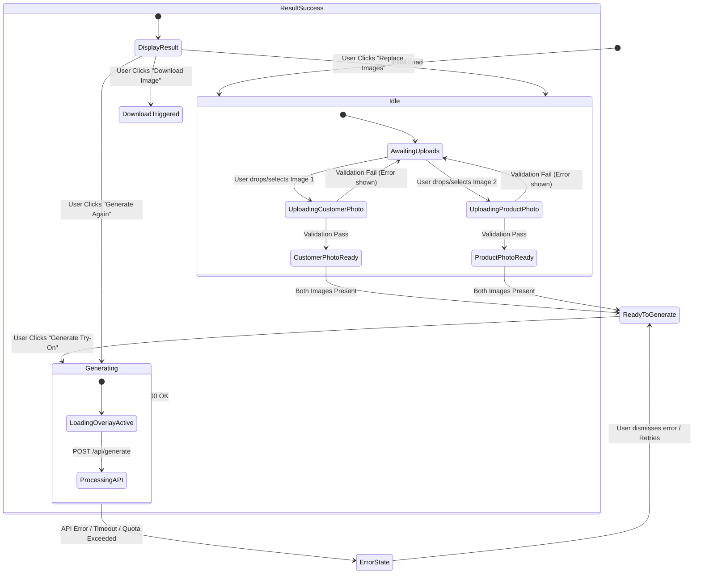

# HairOriginals AI Virtual Try-On — Current State Audit (As-Is, Pre-V2)

**Purpose of this file:** This is a snapshot of the existing MVP codebase (`hair-tryon`) as it stands today, before any V2 work begins. Pair this with `context.md` (the V2 target spec) and `build-prompt.md` (the implementation kickoff prompt) — this file answers "what already exists," `context.md` answers "what we're building toward."

---

## 1. Project Overview & Technology Stack

**HairOriginals AI Virtual Try-On** is a web application letting users visually test hair extensions, wigs, and toppers on their own photos using generative AI. It uses Google Gemini's multimodal capabilities to perform photorealistic hair transfer while preserving facial identity, clothing, pose, and lighting.

### Core Tech Stack
- **Framework**: Next.js 16.2.9 (App Router architecture with TypeScript)
- **UI Library**: React 19.2.4 & React DOM 19.2.4
- **Styling**: Tailwind CSS v4 (`@tailwindcss/postcss`) with custom dark aesthetic, HSL gradients, glassmorphism, and animations
- **Icons**: Lucide React 1.21.0
- **AI / Multimodal SDK**: `@google/genai` 2.10.0 (model `gemini-3.1-flash-image`)
- **Language**: TypeScript 5

---

## 2. Codebase Structure & File Map

```
/
├── app/
│   ├── api/
│   │   └── generate/
│   │       └── route.ts         # Serverless API route handling image generation & Gemini SDK execution
│   ├── favicon.ico
│   ├── globals.css              # Tailwind CSS v4 setup, dark theme resets, focus rings, keyframes
│   ├── layout.tsx               # Global root layout containing Navbar and Footer wrappers
│   └── page.tsx                 # Core client page managing full application state & workflows
├── components/
│   ├── Footer.tsx               # Persistent bottom footer with branding & attribution
│   ├── GenerateButton.tsx       # Primary CTA button with gradient shimmer and loading states
│   ├── ImagePreview.tsx         # Component rendering aspect-ratio constrained image previews
│   ├── ImageUploader.tsx        # Drag-and-drop file uploader with validation & accessibility
│   ├── LoadingOverlay.tsx       # Fullscreen processing modal with dual-gradient spinner & status cycling
│   ├── Navbar.tsx               # Sticky header with branding logo and status badge
│   └── ResultViewer.tsx         # Display container for generated results with action buttons
├── lib/
│   ├── gemini.ts                # Server-side helper interacting with @google/genai SDK
│   ├── prompt.ts                # Optimized AI prompt engineering for hair try-on transformations
│   └── types.ts                 # TypeScript models, guard functions, and validation constants
├── .env.local                   # Environment variables (stores GEMINI_API_KEY)
├── next.config.ts               # Next.js configuration (25MB body limit for server actions/requests)
└── package.json                 # Project manifest and dependency declarations
```

---

## 3. Application State Architecture

Centralized client-side state management is implemented in `app/page.tsx` using React standard hooks.

### Core Application State (`app/page.tsx`)
| State Variable | Type | Default | Description |
| :--- | :--- | :--- | :--- |
| `personImage` | `UploadedImage \| undefined` | `undefined` | Customer's base photo object (contains File, dataUrl, base64, mimeType). |
| `productImage` | `UploadedImage \| undefined` | `undefined` | Selected HairOriginals hair product photo object. |
| `result` | `GenerateResponse \| null` | `null` | Holds the generated output image's base64 string and MIME type upon success. |
| `loading` | `boolean` | `false` | Indicates active API request execution; triggers overlay and disables inputs. |
| `error` | `string \| null` | `null` | Stores error strings to be displayed in top alert banner. |

### Derived State
- **`canGenerate`**: `!!personImage && !!productImage`. Both images must be uploaded before generation can trigger.

### Component-Local States
- **`ImageUploader.tsx`**: `dragOver` (boolean), `error` (string | null — localized file validation error).
- **`LoadingOverlay.tsx`**: `messageIndex` (number — rotates status strings every 3,000ms), `fade` (boolean — opacity transition between message swaps).

**Important for V2 planning:** there is currently **no database and no auth** — nothing here persists beyond the browser tab. Every generation, every uploaded image, and every result disappears on refresh.

---

## 4. Workflows & State Transitions



### Detailed Workflow Analysis

#### Workflow 1: Image Upload & Client-Side Validation
1. User selects or drags & drops an image into either the "Customer Photo" or "Hair Product" uploader zone.
2. **Validation (`ImageUploader.tsx`)**: checks MIME type against `["image/png", "image/jpeg", "image/webp"]`; checks file size against a max of 10MB (10,485,760 bytes). Invalid files set a local `error` state and show an inline warning.
3. **Processing**: valid files are converted to base64 data URLs via `FileReader` and stored in global `personImage` / `productImage` state.
4. **CTA Enablement**: once both images are populated, `canGenerate` becomes `true`, unlocking the "Generate Try-On" CTA.

#### Workflow 2: Generation Request & Server Processing
1. User clicks "Generate Try-On."
2. `loading` → `true`, `error` cleared, `result` reset to `null`.
3. `LoadingOverlay` renders modally with backdrop blur, cycling progress messages every 3 seconds.
4. A `FormData` payload with `personImage` and `productImage` is POSTed to `/api/generate`.
5. **Route execution**: re-validates payload presence, MIME types, and file sizes; converts files to base64 buffer strings; calls `generateTryOn()` in `lib/gemini.ts`; sends a multimodal content array (`[personInlineData, productInlineData, HAIR_TRYON_PROMPT]`) to the Gemini SDK (`gemini-3.1-flash-image`) with `responseModalities: ["IMAGE", "TEXT"]`.
6. **Completion**: on success (200), server returns `{ imageBase64, mimeType }` and `result` updates; on failure, errors (400/401/429/500) are caught, parsed, and set into the global `error` state.

#### Workflow 3: Result Viewing & Export
1. When `result` is present and `loading` is `false`, `ResultViewer.tsx` renders with a fade-in transition, showing the generated image with a corner watermark (`HairOriginals AI`).
2. **Available actions**: Download Image (creates an invisible `<a>` with a `data:` URL, filename `hairoriginals-tryon-<timestamp>.<ext>`); Generate Again (re-runs `handleGenerate()` with existing uploads); Replace Images (clears `result` while preserving uploads).

---

## 5. Security, Rules & API Configuration

- **API security**: `GEMINI_API_KEY` is accessed server-side only (`lib/gemini.ts`), never exposed to the client.
- **Route timeout**: `app/api/generate/route.ts` sets `export const maxDuration = 120;` to avoid serverless timeouts on slow generations.
- **Payload limits**: Next.js server request body size limit expanded to 25MB in `next.config.ts` to handle dual high-resolution uploads.
- **Accessibility/UX**: ARIA attributes (`role="status"`, `role="alert"`, `aria-label`, `aria-hidden`), high-contrast focus indicators, smooth transitions, responsive grid layouts.

---

## 6. What's Explicitly Missing (relative to V2 / context.md)

This list exists so it doesn't need to be re-derived later — it's the gap `build-prompt.md` is built to close:

- No database of any kind (no Users, Products, Categories, Generations — nothing persists)
- No authentication (no Supabase, no Phone OTP, no accounts)
- No product catalog — the "product" side is just a second manual image upload, not a browsable database-backed catalog
- No generation history / storage of past results
- No usage limits or quota logic of any kind (anyone can generate unlimited times)
- No admin dashboard, no roles, no CRM, no analytics, no prompt versioning (the single prompt is hardcoded in `lib/prompt.ts`)
- No camera-capture mode (Mode 2) — upload-only today
- No face/quality validation on the uploaded photo
- Generation is fully synchronous (one `fetch` → wait → response), not job/queue-based

---

## 7. Author's Own Suggested Next Steps (from the original audit)

These were flagged independently of the V2 spec and are still reasonable, lower-priority ideas worth keeping on the backlog:

1. **Preset Model Catalog** — a gallery of pre-loaded HairOriginals product photos so users don't need to upload their own product image (this is effectively subsumed by the V2 Product Catalog requirement).
2. **Before/After Slider** — interactive comparison slider in `ResultViewer` (already listed as a V2 future feature).
3. **Session History** — local-storage caching of recent generations within a session (superseded by proper server-side Generation history in V2, but could be a cheap interim win).
